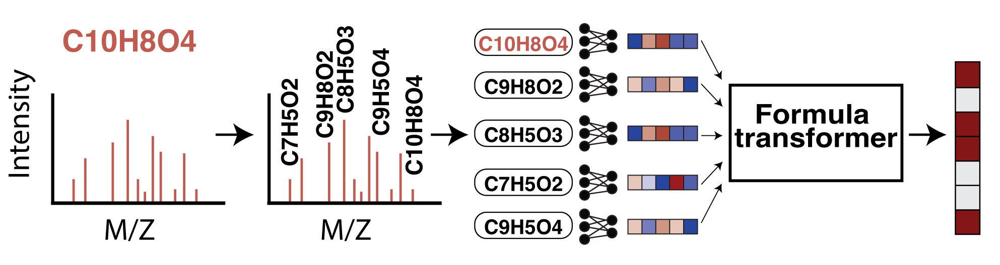

# 🌫️ MIST: Metabolite Inference with Spectrum Transformers
_Samuel Goldman, Jeremy Wohlwend, Martin Strazar, Guy Haroush, Ramnik J. Xavier, Connor W. Coley_

[](https://zenodo.org/badge/latestdoi/564051299)  

This repository provides a minimal codebase for training the MIST encoders used in the FRIGID pipeline. This code is forked from the original [MIST codebase](https://github.com/samgoldman97/mist) with some additions to improve performance on *de novo* generation and many of the original retrieval workflows removed for simplicity/ease of environment setup. Specifically, we added additional synthetic training data, scaled the model size, changed to a cosine learning rate schedule, added EMA decay, removed the magma auxiliary loss, and tweaked various other hyperparameters to improve performance. 




## Table of Contents

1. [Install & setup](#setup)      
3. [Data](#data)   
4. [Training models](#training)     
7. [Citations](#citations)     

## Install & setup <a name="setup"></a>

After git cloning the repository, the environment and package can be installed. We recommend replacing conda with [mamba](https://mamba.readthedocs.io/en/latest/installation.html) for fast install (e.g., `mamba env create -f environment.yml`).

```
conda env create -y -n mist python=3.9
conda activate mist
pip install torch==2.7.0 torchvision==0.22.0 torchaudio==2.7.0 --index-url https://download.pytorch.org/whl/cu118
pip install -r requirements.txt
pip install -e .
```

This environment was tested on Ubuntu 20.04.1 with CUDA Version 11.4 . It takes roughly 10 minutes to install using Mamba. 


## Data <a name="data"></a>

_Note: following prior works, we refer to the NPLIB1 dataset as CANOPUS in our codebase_

While the original MIST paper trained on small amounts of simulated spectra, we use much larger-scale synthetic training datasets consisting of ICEBERG-simulated spectra. We mix in this synthetic data with experimental spectra when training the MIST encoders. In order to have a fair evaluation, the CANOPUS and MassSpecGym synthetic training datasets do not contain any CANOPUS/MassSpecGym test or validation structures, and the spectra are simulated using ICEBERG checkpoints trained _only_ on the CANOPUS/MassSpecGym datasets. This ensures that we never include any additional experimental spectra outside of the CANOPUS/MassSpecGym training datasets.  

To download/process all of the necessary data, run the scripts in the `data/` folder on the `main` branch first to download the original CANOPUS/MassSpecGym datasets, and then run the scripts in the `data/` folder on this branch (`MIST-FRIGID`) to download the synthetic datasets.

## Training models <a name="training"></a>

The below scripts/settings are used to train the the CANOPUS/MassSpecGym MIST encoders used by FRIGID.

CANOPUS training:

```
CUDA_VISIBLE_DEVICES=0 python src/mist/train_mist.py \
    --cache-featurizers \
    --use-wandb \
    --name canopus_mist \
    --labels-file 'data/canopus/labels.tsv' \
    --subform-folder 'data/canopus/subformulae/' \
    --spec-folder 'data/canopus/spec_files' \
    --fp-names morgan4096 \
    --num-workers 16 \
    --seed 1 \
    --gpus 1 \
    --batch-size 256 \
    --iterative-preds 'growing' \
    --iterative-loss-weight 0.4 \
    --learning-rate 0.00077 \
    --weight-decay 1e-07 \
    --lr-decay-frac 0.9 \
    --hidden-size 512 \
    --pairwise-featurization \
    --peak-attn-layers 2 \
    --refine-layers 4 \
    --spectra-dropout 0.1 \
    --split-file 'data/canopus/splits/canopus_hplus_100_0.tsv' \
    --form-embedder 'pos-cos' \
    --no-diffs \
    --save-dir results/ \
    --shuffle-train \
    --augment-data \
    --frac-orig 0.25 \
    --cosine-schedule \
    --max-epochs 300 \
    --warmup-frac 0.1 \
    --forward-labels data/canopus_aug/labels.csv \
    --forward-aug-folder data/canopus_aug/subformulae \
    --ema \
    --ema-decay 0.995 \
    --max-peaks 15
```

MassSpecGym training:

```
# export CUDA_DEVICE_ORDER=PCI_BUS_ID

CUDA_VISIBLE_DEVICES=0 python src/mist/train_mist.py \
    --cache-featurizers \
    --use-wandb \
    --name msg_mist \
    --labels-file data/msg/labels.tsv \
    --subform-folder data/msg/subformulae/ \
    --spec-folder data/msg/spec_files \
    --fp-names morgan4096 \
    --num-workers 16 \
    --seed 1 \
    --gpus 1 \
    --batch-size 256 \
    --iterative-preds 'growing' \
    --iterative-loss-weight 0.4 \
    --learning-rate 0.00077 \
    --weight-decay 1e-07 \
    --lr-decay-frac 0.9 \
    --hidden-size 640 \
    --pairwise-featurization \
    --peak-attn-layers 2 \
    --refine-layers 4 \
    --spectra-dropout 0.1 \
    --split-file data/msg/split.tsv \
    --form-embedder 'pos-cos' \
    --no-diffs \
    --save-dir results/ \
    --shuffle-train \
    --augment-data \
    --frac-orig 0.08 \
    --cosine-schedule \
    --max-epochs 150 \
    --warmup-frac 0.1 \
    --forward-labels data/msg_aug/labels.csv \
    --forward-aug-folder data/msg_aug/subformulae \
    --ema \
    --ema-decay 0.995 \
    --max-peaks 10
```

The [train_mist.py](src/mist/train_mist.py) script results will contain a `spectra_encoder.pt` file which is then used in the FRIGID inference code.

## Citations <a name="citations"></a>  

We ask users to cite [MIST](https://www.nature.com/articles/s42256-023-00708-3) directly by referencing the following paper:

Goldman, S., Wohlwend, J., Stražar, M. et al. Annotating metabolite mass spectra with domain-inspired chemical formula transformers. Nat Mach Intell (2023). https://doi.org/10.1038/s42256-023-00708-3   

MIST also builds on a number of other projects, ideas, and software including SIRIUS, MAGMa substructure labeling, the canopus\_train data, the Mills et al. IBD data, NPClassifier to classify compounds, PubChem as a retrieval library, and HMDB as a retrieval library. Please consider citing the following full list of papers when relevant:  
 
1. Kai Dührkop, Markus Fleischauer, Marcus Ludwig, Alexander A. Aksenov, Alexey V. Melnik, Marvin Meusel, Pieter C. Dorrestein, Juho Rousu, and Sebastian Böcker, SIRIUS 4: Turning tandem mass spectra into metabolite structure information. Nature Methods 16, 299–302, 2019.   
2. Ridder, Lars, Justin JJ van der Hooft, and Stefan Verhoeven. "Automatic compound annotation from mass spectrometry data using MAGMa." Mass Spectrometry 3.Special_Issue_2 (2014): S0033-S0033.    
3. Wang, Mingxun, et al. "Sharing and community curation of mass spectrometry data with Global Natural Products Social Molecular Networking." Nature biotechnology 34.8 (2016): 828-837.    
4. Dührkop, Kai, et al. "Systematic classification of unknown metabolites using high-resolution fragmentation mass spectra." Nature Biotechnology 39.4 (2021): 462-471.   
5. Mills, Robert H., et al. "Multi-omics analyses of the ulcerative colitis gut microbiome link Bacteroides vulgatus proteases with disease severity." Nature Microbiology 7.2 (2022): 262-276.   
6. Kim, Hyun Woo, et al. "NPClassifier: a deep neural network-based structural classification tool for natural products." Journal of natural products 84.11 (2021): 2795-2807.   
7. Kim, Sunghwan, et al. "PubChem 2019 update: improved access to chemical data." Nucleic acids research 47.D1 (2019): D1102-D1109.    
8. Wishart, David S., et al. "HMDB 5.0: the human metabolome database for 2022." Nucleic Acids Research 50.D1 (2022): D622-D631.
